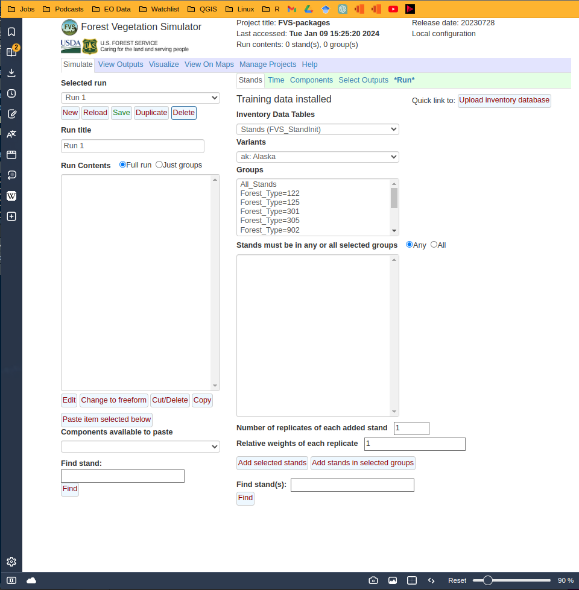

Linux Install Options from R-base or Bash Terminals
================
2024-01-09

- These instructions were copied from open-fvs’ source-forge pages found
  [here](https://sourceforge.net/p/open-fvs/wiki/browse_pages/).

- Package installation files, builds, docs, installs were cloned from
  USFS’s github repo
  [here](https://github.com/USDAForestService/ForestVegetationSimulator-Interface)
  and renamed as `FVS-packages`. This provided simpler install for
  Ubuntu 20.04 system than the svn downloads linked on the source-forge
  pages.

- Shared libraries of FVS functions and settings were cloned from USFS’s
  github repo
  [here](https://github.com/USDAForestService/ForestVegetationSimulator.git)
  and renamed as `FVS-libraries`.

- For succesful r-base deploy on Ubuntu, make sure to assign ‘UTF-8’
  format by saving this markdown as script.R file inside the
  `FVS-packages` directory using the ‘Save as’ function from inside your
  IDE and following formatting prompt.

- For reference, this linux environment and R-session info are posted
  following package installation below.

``` r
list.of.packages <- c(
  "devtools", "shiny", "Cairo", "rhandsontable",
  "ggplot2", "parallel", "RSQLite", "plyr",
  "dplyr", "colourpicker", "rgl", "leaflet",
  "zip", "openxlsx", "rgdal", "nlme"
)

new.packages <- list.of.packages[!(list.of.packages %in% installed.packages()[, "Package"])]
if (length(new.packages)) install.packages(new.packages)

update.packages(ask = FALSE, checkBuilt = TRUE)
devtools::session_info()
```

    ## ─ Session info ───────────────────────────────────────────────────────────────
    ##  setting  value
    ##  version  R version 4.3.2 (2023-10-31)
    ##  os       Ubuntu 20.04.6 LTS
    ##  system   x86_64, linux-gnu
    ##  ui       X11
    ##  language en_IE:en
    ##  collate  en_IE.UTF-8
    ##  ctype    en_IE.UTF-8
    ##  tz       Europe/Dublin
    ##  date     2024-01-09
    ##  pandoc   3.1.1 @ /usr/lib/rstudio/resources/app/bin/quarto/bin/tools/ (via rmarkdown)
    ## 
    ## ─ Packages ───────────────────────────────────────────────────────────────────
    ##  package     * version date (UTC) lib source
    ##  cachem        1.0.8   2023-05-01 [1] CRAN (R 4.3.2)
    ##  cli           3.6.2   2023-12-11 [1] CRAN (R 4.3.2)
    ##  devtools      2.4.5   2022-10-11 [1] CRAN (R 4.3.2)
    ##  digest        0.6.33  2023-07-07 [1] CRAN (R 4.3.2)
    ##  ellipsis      0.3.2   2021-04-29 [1] CRAN (R 4.3.2)
    ##  evaluate      0.23    2023-11-01 [1] CRAN (R 4.3.2)
    ##  fastmap       1.1.1   2023-02-24 [1] CRAN (R 4.3.2)
    ##  fs            1.6.3   2023-07-20 [1] CRAN (R 4.3.2)
    ##  glue          1.6.2   2022-02-24 [1] CRAN (R 4.3.2)
    ##  htmltools     0.5.7   2023-11-03 [1] CRAN (R 4.3.2)
    ##  htmlwidgets   1.6.4   2023-12-06 [1] CRAN (R 4.3.2)
    ##  httpuv        1.6.13  2023-12-06 [1] CRAN (R 4.3.2)
    ##  knitr         1.45    2023-10-30 [1] CRAN (R 4.3.2)
    ##  later         1.3.2   2023-12-06 [1] CRAN (R 4.3.2)
    ##  lifecycle     1.0.4   2023-11-07 [1] CRAN (R 4.3.2)
    ##  magrittr      2.0.3   2022-03-30 [1] CRAN (R 4.3.2)
    ##  memoise       2.0.1   2021-11-26 [1] CRAN (R 4.3.2)
    ##  mime          0.12    2021-09-28 [1] CRAN (R 4.3.2)
    ##  miniUI        0.1.1.1 2018-05-18 [1] CRAN (R 4.3.2)
    ##  pkgbuild      1.4.3   2023-12-10 [1] CRAN (R 4.3.2)
    ##  pkgload       1.3.3   2023-09-22 [1] CRAN (R 4.3.2)
    ##  profvis       0.3.8   2023-05-02 [1] CRAN (R 4.3.2)
    ##  promises      1.2.1   2023-08-10 [1] CRAN (R 4.3.2)
    ##  purrr         1.0.2   2023-08-10 [1] CRAN (R 4.3.2)
    ##  R.cache       0.16.0  2022-07-21 [1] CRAN (R 4.3.2)
    ##  R.methodsS3   1.8.2   2022-06-13 [1] CRAN (R 4.3.2)
    ##  R.oo          1.25.0  2022-06-12 [1] CRAN (R 4.3.2)
    ##  R.utils       2.12.3  2023-11-18 [1] CRAN (R 4.3.2)
    ##  R6            2.5.1   2021-08-19 [1] CRAN (R 4.3.2)
    ##  Rcpp          1.0.12  2024-01-09 [1] CRAN (R 4.3.2)
    ##  remotes       2.4.2.1 2023-07-18 [1] CRAN (R 4.3.2)
    ##  rlang         1.1.2   2023-11-04 [1] CRAN (R 4.3.2)
    ##  rmarkdown     2.25    2023-09-18 [1] CRAN (R 4.3.2)
    ##  rstudioapi    0.15.0  2023-07-07 [1] CRAN (R 4.3.2)
    ##  sessioninfo   1.2.2   2021-12-06 [1] CRAN (R 4.3.2)
    ##  shiny         1.8.0   2023-11-17 [1] CRAN (R 4.3.2)
    ##  stringi       1.8.3   2023-12-11 [1] CRAN (R 4.3.2)
    ##  stringr       1.5.1   2023-11-14 [1] CRAN (R 4.3.2)
    ##  styler        1.10.2  2023-08-29 [1] CRAN (R 4.3.2)
    ##  urlchecker    1.0.1   2021-11-30 [1] CRAN (R 4.3.2)
    ##  usethis       2.2.2   2023-07-06 [1] CRAN (R 4.3.2)
    ##  vctrs         0.6.5   2023-12-01 [1] CRAN (R 4.3.2)
    ##  xfun          0.41    2023-11-01 [1] CRAN (R 4.3.2)
    ##  xtable        1.8-4   2019-04-21 [1] CRAN (R 4.3.2)
    ##  yaml          2.3.8   2023-12-11 [1] CRAN (R 4.3.2)
    ## 
    ##  [1] /home/seamus/R/x86_64-pc-linux-gnu-library/4.3
    ##  [2] /usr/local/lib/R/site-library
    ##  [3] /usr/lib/R/site-library
    ##  [4] /usr/lib/R/library
    ## 
    ## ──────────────────────────────────────────────────────────────────────────────

``` r
capabilities()
```

    ##        jpeg         png        tiff       tcltk         X11        aqua 
    ##        TRUE        TRUE        TRUE        TRUE        TRUE       FALSE 
    ##    http/ftp     sockets      libxml        fifo      cledit       iconv 
    ##        TRUE        TRUE       FALSE        TRUE       FALSE        TRUE 
    ##         NLS       Rprof     profmem       cairo         ICU long.double 
    ##        TRUE        TRUE        TRUE        TRUE        TRUE        TRUE 
    ##     libcurl 
    ##        TRUE

# **Build from Bash Terminal**

##### **Download docs, builds and installation files**

Change directory into preferred folder. Cloned github repo including
fvsOL and rFVS packages build files and renamed folder
`ForestVegetationSimulator-Interface` as `FVS-packages`. This
`FVS-packages` folder will is the top level or trunk from where to run
all installs. Uncomment as necessary below.

``` bash
#cd ~/Desktop/git_repos
#git clone https://github.com/USDAForestService/ForestVegetationSimulator-Interface.git
#mv ForestVegetationSimulator-Interface FVS-packages
cd ~/Desktop/git_repos/FVS-packages
ls
```

    ## deploy-screenshot.png
    ## FVSDataConvert
    ## FVS_Data.db
    ## fvsOL
    ## fvsOL_2023.07.28.tar.gz
    ## FVSOnline.log
    ## FVSOnline.older.log
    ## FVSOut.db
    ## FVSPrjBldr
    ## FVSProject.db
    ## linux-installs.html
    ## linux-installs.md
    ## linux-installs.Rmd
    ## projectId.txt
    ## projectIsLocked.txt
    ## rFVS
    ## rFVS_2023.02.01.tar.gz
    ## Screenshot from 2024-01-09 16-09-37.png
    ## SpatialData.RData
    ## www

##### **Download shared libraries of FVS package functions**

Note: this `FVS-libraries` repo includes the ‘FVSbin’ folder referenced
in source-forge launch instructions.

``` bash
#cd ~/Desktop/git_repos
#git clone https://github.com/USDAForestService/ForestVegetationSimulator.git
#mv ForestVegetationSimulator FVS-libraries
cd ~/Desktop/git_repos/FVS-libraries
ls
```

    ## acd
    ## ak
    ## archive
    ## base
    ## bin
    ## bm
    ## ca
    ## canada
    ## changeNotes
    ## ci
    ## clim
    ## common
    ## Contributing.md
    ## covr
    ## cr
    ## cs
    ## dbs
    ## dbsqlite
    ## dfb
    ## dftm
    ## ec
    ## econ
    ## em
    ## estb
    ## fire
    ## ie
    ## kt
    ## license.txt
    ## lpmpb
    ## ls
    ## metric
    ## mistoe
    ## nc
    ## ne
    ## oc
    ## op
    ## organon
    ## pg
    ## pn
    ## rd
    ## README.md
    ## Security.md
    ## sn
    ## so
    ## strp
    ## tests
    ## tt
    ## ut
    ## vbase
    ## vcovr
    ## vdbs
    ## vdbsqlite
    ## vestb
    ## vie
    ## vls
    ## volume
    ## vorganon
    ## vso
    ## vstrp
    ## vvolume
    ## vwc
    ## vws
    ## wc
    ## wpbr
    ## ws
    ## wsbwe
    ## wwpb

##### Compile build files using `makefile` found in sub-directory of downloaded repo

``` bash
make -v # check make version for updates
cd ~/Desktop/git_repos/FVS-packages/fvsOL
make
```

    ## GNU Make 4.2.1
    ## Built for x86_64-pc-linux-gnu
    ## Copyright (C) 1988-2016 Free Software Foundation, Inc.
    ## License GPLv3+: GNU GPL version 3 or later <http://gnu.org/licenses/gpl.html>
    ## This is free software: you are free to change and redistribute it.
    ## There is NO WARRANTY, to the extent permitted by law.
    ## make: Nothing to be done for 'all'.

##### **Build `fvsOL` installation from R scripts**

If running terminal from RStudio or inside .Rmd chunk, working directory
must be set to trunk location,
i.e. `setwd("~/Desktop/git_repos/FVS-packages"` . Alternatively, open
the full script file and hit ‘Run All’.

``` r
source("fvsOL/parms/mkpkeys.R", local = knitr::knit_global())
sys.source("fvsOL/inst/extdata/mkhelp.R", envir = knitr::knit_global()) 
```

##### **Build** devtools installation files

``` r
Rscript --default-packages=devtools -e "devtools::document(pkg='fvsOL')" 
Rscript --default-packages=devtools -e "devtools::build(pkg='fvsOL')" 
Rscript --default-packages=devtools -e "devtools::install(pkg='fvsOL',type='source',repos=NULL)"
```

##### **Build `rFVS` installation from make files and scripts as above**

``` r
cd ~/Desktop/git_repos/FVS-packages/rFVS
make
Rscript --default-packages=devtools -e "devtools::document(pkg='rFVS')" 
Rscript --default-packages=devtools -e "devtools::build(pkg='rFVS')" 
Rscript --default-packages=devtools -e "devtools::install(pkg='rFVS',type='source',repos=NULL)"
```

##### Assign location of `FVS-libraries` and launch Forest Vegetation Simulator in browser

Change folder path of shared libraries to location of downloaded
repository originally called \`ForestVegetationSimulator’ and now
renamed as ‘FVS-libraries’.

``` r
R -e "require(fvsOL);fvsOL(fvsBin='~/Desktop/git_repos/FVS-libraries/bin')"
```

<figure>

<figcaption aria-hidden="true">Deployed using chromium-based
browser</figcaption>
</figure>
