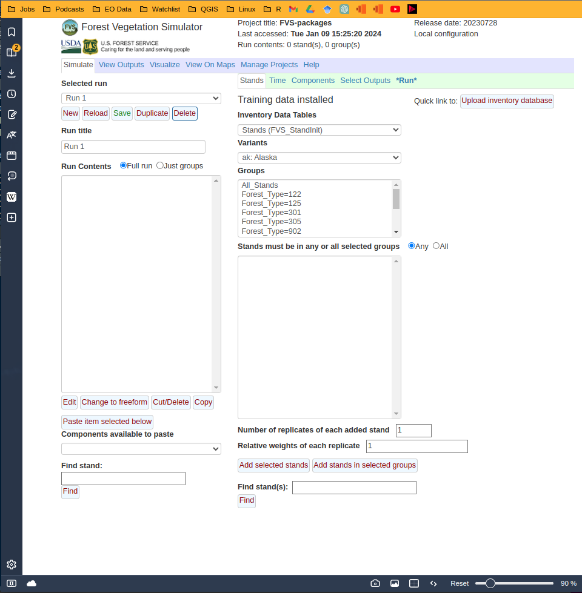

Linux Install of FVS using r-base & bash
================
2024-01-09

- These instructions were copied from open-fvs’ source-forge pages found
  [here](https://sourceforge.net/p/open-fvs/wiki/browse_pages/).

- Package installation files, builds, docs, installs were cloned from
  USFS’s github repo
  [here](https://github.com/USDAForestService/ForestVegetationSimulator-Interface)
  and renamed as `FVS-packages`. This provided simpler install for
  Ubuntu 20.04 system than the svn downloads linked on the source-forge
  pages.

- Shared libraries of FVS functions and settings were cloned from USFS’s
  github repo
  [here](https://github.com/USDAForestService/ForestVegetationSimulator.git)
  and renamed as `FVS-libraries`.

- For succesful r-base deploy on Ubuntu, make sure to assign ‘UTF-8’
  format by saving this markdown as script.R file inside the
  `FVS-packages` directory using the ‘Save as’ function from inside your
  IDE and following formatting prompt.

- For reference, this linux environment and R-session info are posted
  following package installation below.

``` r
list.of.packages <- c(
  "devtools", "shiny", "Cairo", "rhandsontable",
  "ggplot2", "parallel", "RSQLite", "plyr",
  "dplyr", "colourpicker", "rgl", "leaflet",
  "zip", "openxlsx", "rgdal", "nlme"
)

new.packages <- list.of.packages[!(list.of.packages %in% installed.packages()[, "Package"])]
if (length(new.packages)) install.packages(new.packages)

update.packages(ask = FALSE, checkBuilt = TRUE)
devtools::session_info()
```

    ## ─ Session info ───────────────────────────────────────────────────────────────
    ##  setting  value
    ##  version  R version 4.3.2 (2023-10-31)
    ##  os       Ubuntu 20.04.6 LTS
    ##  system   x86_64, linux-gnu
    ##  ui       X11
    ##  language en_IE:en
    ##  collate  en_IE.UTF-8
    ##  ctype    en_IE.UTF-8
    ##  tz       Europe/Dublin
    ##  date     2024-01-09
    ##  pandoc   3.1.1 @ /usr/lib/rstudio/resources/app/bin/quarto/bin/tools/ (via rmarkdown)
    ## 
    ## ─ Packages ───────────────────────────────────────────────────────────────────
    ##  package     * version date (UTC) lib source
    ##  cachem        1.0.8   2023-05-01 [1] CRAN (R 4.3.2)
    ##  cli           3.6.2   2023-12-11 [1] CRAN (R 4.3.2)
    ##  devtools      2.4.5   2022-10-11 [1] CRAN (R 4.3.2)
    ##  digest        0.6.33  2023-07-07 [1] CRAN (R 4.3.2)
    ##  ellipsis      0.3.2   2021-04-29 [1] CRAN (R 4.3.2)
    ##  evaluate      0.23    2023-11-01 [1] CRAN (R 4.3.2)
    ##  fastmap       1.1.1   2023-02-24 [1] CRAN (R 4.3.2)
    ##  fs            1.6.3   2023-07-20 [1] CRAN (R 4.3.2)
    ##  glue          1.6.2   2022-02-24 [1] CRAN (R 4.3.2)
    ##  htmltools     0.5.7   2023-11-03 [1] CRAN (R 4.3.2)
    ##  htmlwidgets   1.6.4   2023-12-06 [1] CRAN (R 4.3.2)
    ##  httpuv        1.6.13  2023-12-06 [1] CRAN (R 4.3.2)
    ##  knitr         1.45    2023-10-30 [1] CRAN (R 4.3.2)
    ##  later         1.3.2   2023-12-06 [1] CRAN (R 4.3.2)
    ##  lifecycle     1.0.4   2023-11-07 [1] CRAN (R 4.3.2)
    ##  magrittr      2.0.3   2022-03-30 [1] CRAN (R 4.3.2)
    ##  memoise       2.0.1   2021-11-26 [1] CRAN (R 4.3.2)
    ##  mime          0.12    2021-09-28 [1] CRAN (R 4.3.2)
    ##  miniUI        0.1.1.1 2018-05-18 [1] CRAN (R 4.3.2)
    ##  pkgbuild      1.4.3   2023-12-10 [1] CRAN (R 4.3.2)
    ##  pkgload       1.3.3   2023-09-22 [1] CRAN (R 4.3.2)
    ##  profvis       0.3.8   2023-05-02 [1] CRAN (R 4.3.2)
    ##  promises      1.2.1   2023-08-10 [1] CRAN (R 4.3.2)
    ##  purrr         1.0.2   2023-08-10 [1] CRAN (R 4.3.2)
    ##  R.cache       0.16.0  2022-07-21 [1] CRAN (R 4.3.2)
    ##  R.methodsS3   1.8.2   2022-06-13 [1] CRAN (R 4.3.2)
    ##  R.oo          1.25.0  2022-06-12 [1] CRAN (R 4.3.2)
    ##  R.utils       2.12.3  2023-11-18 [1] CRAN (R 4.3.2)
    ##  R6            2.5.1   2021-08-19 [1] CRAN (R 4.3.2)
    ##  Rcpp          1.0.12  2024-01-09 [1] CRAN (R 4.3.2)
    ##  remotes       2.4.2.1 2023-07-18 [1] CRAN (R 4.3.2)
    ##  rlang         1.1.2   2023-11-04 [1] CRAN (R 4.3.2)
    ##  rmarkdown     2.25    2023-09-18 [1] CRAN (R 4.3.2)
    ##  rstudioapi    0.15.0  2023-07-07 [1] CRAN (R 4.3.2)
    ##  sessioninfo   1.2.2   2021-12-06 [1] CRAN (R 4.3.2)
    ##  shiny         1.8.0   2023-11-17 [1] CRAN (R 4.3.2)
    ##  stringi       1.8.3   2023-12-11 [1] CRAN (R 4.3.2)
    ##  stringr       1.5.1   2023-11-14 [1] CRAN (R 4.3.2)
    ##  styler        1.10.2  2023-08-29 [1] CRAN (R 4.3.2)
    ##  urlchecker    1.0.1   2021-11-30 [1] CRAN (R 4.3.2)
    ##  usethis       2.2.2   2023-07-06 [1] CRAN (R 4.3.2)
    ##  vctrs         0.6.5   2023-12-01 [1] CRAN (R 4.3.2)
    ##  xfun          0.41    2023-11-01 [1] CRAN (R 4.3.2)
    ##  xtable        1.8-4   2019-04-21 [1] CRAN (R 4.3.2)
    ##  yaml          2.3.8   2023-12-11 [1] CRAN (R 4.3.2)
    ## 
    ##  [1] /home/seamus/R/x86_64-pc-linux-gnu-library/4.3
    ##  [2] /usr/local/lib/R/site-library
    ##  [3] /usr/lib/R/site-library
    ##  [4] /usr/lib/R/library
    ## 
    ## ──────────────────────────────────────────────────────────────────────────────

``` r
capabilities()
```

    ##        jpeg         png        tiff       tcltk         X11        aqua 
    ##        TRUE        TRUE        TRUE        TRUE        TRUE       FALSE 
    ##    http/ftp     sockets      libxml        fifo      cledit       iconv 
    ##        TRUE        TRUE       FALSE        TRUE       FALSE        TRUE 
    ##         NLS       Rprof     profmem       cairo         ICU long.double 
    ##        TRUE        TRUE        TRUE        TRUE        TRUE        TRUE 
    ##     libcurl 
    ##        TRUE

# **Build from Bash Terminal**

##### **Download docs, builds and installation files**

Change directory into preferred folder. Cloned github repo including
fvsOL and rFVS packages build files and renamed folder
`ForestVegetationSimulator-Interface` as `FVS-packages`. This
`FVS-packages` folder will is the top level or trunk from where to run
all installs. Uncomment as necessary below.

``` bash
#cd ~/Desktop/git_repos
#git clone https://github.com/USDAForestService/ForestVegetationSimulator-Interface.git
#mv ForestVegetationSimulator-Interface FVS-packages
cd ~/Desktop/git_repos/FVS-packages
ls
```

    ## deploy-screenshot.png
    ## FVSDataConvert
    ## fvsOL
    ## FVS-packages.Rproj
    ## FVSPrjBldr
    ## linux_install.Rmd
    ## README.md
    ## rFVS

##### **Download shared libraries of FVS package functions**

Note: this `FVS-libraries` repo includes the ‘FVSbin’ folder referenced
in source-forge launch instructions.

``` bash
#cd ~/Desktop/git_repos
#git clone https://github.com/USDAForestService/ForestVegetationSimulator.git
#mv ForestVegetationSimulator FVS-libraries
cd ~/Desktop/git_repos/FVS-libraries
ls
```

    ## acd
    ## ak
    ## archive
    ## base
    ## bin
    ## bm
    ## ca
    ## canada
    ## changeNotes
    ## ci
    ## clim
    ## common
    ## Contributing.md
    ## covr
    ## cr
    ## cs
    ## dbs
    ## dbsqlite
    ## dfb
    ## dftm
    ## ec
    ## econ
    ## em
    ## estb
    ## fire
    ## ie
    ## kt
    ## license.txt
    ## lpmpb
    ## ls
    ## metric
    ## mistoe
    ## nc
    ## ne
    ## oc
    ## op
    ## organon
    ## pg
    ## pn
    ## rd
    ## README.md
    ## Security.md
    ## sn
    ## so
    ## strp
    ## tests
    ## tt
    ## ut
    ## vbase
    ## vcovr
    ## vdbs
    ## vdbsqlite
    ## vestb
    ## vie
    ## vls
    ## volume
    ## vorganon
    ## vso
    ## vstrp
    ## vvolume
    ## vwc
    ## vws
    ## wc
    ## wpbr
    ## ws
    ## wsbwe
    ## wwpb

##### Compile build files using `makefile` found in sub-directory of downloaded repo

``` bash
make -v # check make version for updates
cd ~/Desktop/git_repos/FVS-packages/fvsOL
make
```

    ## GNU Make 4.2.1
    ## Built for x86_64-pc-linux-gnu
    ## Copyright (C) 1988-2016 Free Software Foundation, Inc.
    ## License GPLv3+: GNU GPL version 3 or later <http://gnu.org/licenses/gpl.html>
    ## This is free software: you are free to change and redistribute it.
    ## There is NO WARRANTY, to the extent permitted by law.
    ## Rscript inst/extdata/mkhelp.R
    ## Loading required package: openxlsx
    ## Erase  data/fvsOnlineHelpRender.RData 
    ## Process OutputTableDescriptions
    ## Processing output table description for tab= CmpCalibStats 
    ## Processing output table description for tab= CmpMetaData 
    ## Processing output table description for tab= CmpStdStk 
    ## Processing output table description for tab= CmpStdStk_East 
    ## Processing output table description for tab= CmpSummary 
    ## Processing output table description for tab= CmpSummary_East 
    ## Processing output table description for tab= CmpSummary2 
    ## Processing output table description for tab= CmpSummary2_East 
    ## Processing output table description for tab= FVS_ATRTList 
    ## Processing output table description for tab= FVS_ATRTList_East 
    ## Processing output table description for tab= FVS_BurnReport 
    ## Processing output table description for tab= FVS_CalibStats 
    ## Processing output table description for tab= FVS_CanProfile 
    ## Processing output table description for tab= FVS_Carbon 
    ## Processing output table description for tab= FVS_Cases 
    ## Processing output table description for tab= FVS_Climate 
    ## Processing output table description for tab= FVS_Compute 
    ## Processing output table description for tab= FVS_Consumption 
    ## Processing output table description for tab= FVS_Cutlist 
    ## Processing output table description for tab= FVS_Cutlist_East 
    ## Processing output table description for tab= FVS_DM_Spp_Sum 
    ## Processing output table description for tab= FVS_DM_Stnd_Sum 
    ## Processing output table description for tab= FVS_DM_Sz_Sum 
    ## Processing output table description for tab= FVS_Down_Wood_Cov 
    ## Processing output table description for tab= FVS_Down_Wood_Vol 
    ## Processing output table description for tab= FVS_EconHarvestValue 
    ## Processing output table description for tab= FVS_EconSummary 
    ## Processing output table description for tab= FVS_Fuels 
    ## Processing output table description for tab= FVS_Hrv_Carbon 
    ## Processing output table description for tab= FVS_Mortality 
    ## Processing output table description for tab= FVS_Potfire 
    ## Processing output table description for tab= FVS_Potfire_Cond 
    ## Processing output table description for tab= FVS_Potfire_East 
    ## Processing output table description for tab= FVS_RD_Beetle 
    ## Processing output table description for tab= FVS_RD_Det 
    ## Processing output table description for tab= FVS_RD_Sum 
    ## Processing output table description for tab= FVS_Regen_HabType 
    ## Processing output table description for tab= FVS_Regen_Ingrow 
    ## Processing output table description for tab= FVS_Regen_SitePrep 
    ## Processing output table description for tab= FVS_Regen_Sprouts 
    ## Processing output table description for tab= FVS_Regen_Tally 
    ## Processing output table description for tab= FVS_SnagDet 
    ## Processing output table description for tab= FVS_SnagSum 
    ## Processing output table description for tab= FVS_Stats_Species 
    ## Processing output table description for tab= FVS_Stats_Stand 
    ## Processing output table description for tab= FVS_StrClass 
    ## Processing output table description for tab= FVS_Summary 
    ## Processing output table description for tab= FVS_Summary_East 
    ## Processing output table description for tab= FVS_Summary2 
    ## Processing output table description for tab= FVS_Summary2_East 
    ## Processing output table description for tab= FVS_Treelist 
    ## Processing output table description for tab= FVS_Treelist_East 
    ## Processing output table description for tab= StdStk 
    ## Processing output table description for tab= StdStk_East 
    ## Processing output table description for tab= View_DWN 
    ## Processing output table description for tab= CmpStdStk_East_Metric 
    ## Processing output table description for tab= CmpStdStk_Metric 
    ## Processing output table description for tab= CmpSummary_East_Metric 
    ## Processing output table description for tab= CmpSummary_Metric 
    ## Processing output table description for tab= CmpSummary2_East_Metric 
    ## Processing output table description for tab= CmpSummary2_Metric 
    ## Processing output table description for tab= FVS_ATRTList_East_Metric 
    ## Processing output table description for tab= FVS_ATRTList_Metric 
    ## Processing output table description for tab= FVS_BurnReport_Metric 
    ## Processing output table description for tab= FVS_Carbon_Metric 
    ## Processing output table description for tab= FVS_Climate_Metric 
    ## Processing output table description for tab= FVS_Consumption_Metric 
    ## Processing output table description for tab= FVS_Cutlist_East_Metric 
    ## Processing output table description for tab= FVS_Cutlist_Metric 
    ## Processing output table description for tab= FVS_DM_Spp_Sum_Metric 
    ## Processing output table description for tab= FVS_DM_Stnd_Sum_Metric 
    ## Processing output table description for tab= FVS_DM_Sz_Sum_Metric 
    ## Processing output table description for tab= FVS_Down_Wood_Cov_Metric 
    ## Processing output table description for tab= FVS_Down_Wood_Vol_Metric 
    ## Processing output table description for tab= FVS_EconHarvestValue_Metric 
    ## Processing output table description for tab= FVS_EconSummary_Metric 
    ## Processing output table description for tab= FVS_Fuels_Metric 
    ## Processing output table description for tab= FVS_Hrv_Carbon_Metric 
    ## Processing output table description for tab= FVS_Mortality_Metric 
    ## Processing output table description for tab= FVS_Potfire_Cond_Metric 
    ## Processing output table description for tab= FVS_Potfire_East_Metric 
    ## Processing output table description for tab= FVS_Potfire_Metric 
    ## Processing output table description for tab= FVS_RD_Beetle_Metric 
    ## Processing output table description for tab= FVS_RD_Det_Metric 
    ## Processing output table description for tab= FVS_RD_Sum_Metric 
    ## Processing output table description for tab= FVS_Regen_Ingrow_Metric 
    ## Processing output table description for tab= FVS_Regen_Sprouts_Metric 
    ## Processing output table description for tab= FVS_Regen_Tally_Metric 
    ## Processing output table description for tab= FVS_SnagDet_Metric 
    ## Processing output table description for tab= FVS_SnagSum_Metric 
    ## Processing output table description for tab= FVS_Stats_Species_Metric 
    ## Processing output table description for tab= FVS_StrClass_Metric 
    ## Processing output table description for tab= FVS_Summary_East_Metric 
    ## Processing output table description for tab= FVS_Summary_Metric 
    ## Processing output table description for tab= FVS_Summary2_East_Metric 
    ## Processing output table description for tab= FVS_Summary2_Metric 
    ## Processing output table description for tab= FVS_Treelist_East_Metric 
    ## Processing output table description for tab= FVS_Treelist_Metric 
    ## Processing output table description for tab= StdStk_East_Metric 
    ## Processing output table description for tab= StdStk_Metric 
    ## Processing output table description for tab= View_DWN_Metric 
    ## Process InputTableDescriptions
    ## Processing input table description for tab= FVS_GroupAddFilesAndKeywords 
    ## Processing input table description for tab= FVS_StandInit 
    ## Processing input table description for tab= FVS_PlotInit 
    ## Processing input table description for tab= FVS_TreeInit 
    ## Saving fvshelp file  data/fvsOnlineHelpRender.RData 
    ## Rscript parms/mkpkeys.R
    ## processing file= parms/ardwrd3.kwd 
    ## processing file= parms/armwrd3.kwd 
    ## processing file= parms/basekeys.kwd 
    ## processing file= parms/climate.kwd 
    ## processing file= parms/cond.rul 
    ## processing file= parms/cover.kwd 
    ## processing file= parms/dbs.kwd 
    ## processing file= parms/econ.kwd 
    ## processing file= parms/estab.kwd 
    ## processing file= parms/fire.kwd 
    ## processing file= parms/forest.prm 
    ## processing file= parms/fueltrt.prm 
    ## processing file= parms/function.evm 
    ## processing file= parms/habpa_bm.prm 
    ## processing file= parms/habpa_ca.prm 
    ## processing file= parms/habpa_ci.prm 
    ## processing file= parms/habpa_ec.prm 
    ## processing file= parms/habpa_em.prm 
    ## processing file= parms/habpa_ie.prm 
    ## processing file= parms/habpa_kt.prm 
    ## processing file= parms/habpa_ls.prm 
    ## processing file= parms/habpa_ni.prm 
    ## processing file= parms/HabPa_oc.prm 
    ## processing file= parms/habpa_op.prm 
    ## processing file= parms/habpa_pn.prm 
    ## processing file= parms/habpa_sn.prm 
    ## processing file= parms/habpa_so.prm 
    ## processing file= parms/habpa_ut.prm 
    ## processing file= parms/habpa_wc.prm 
    ## processing file= parms/inttrtmt.prm 
    ## processing file= parms/keycats.prm 
    ## processing file= parms/keylist.prm 
    ## processing file= parms/manage.prm 
    ## processing file= parms/mdoutputs.prm 
    ## processing file= parms/mgmtcats.prm 
    ## processing file= parms/mist.kwd 
    ## processing file= parms/mkpkeys.R 
    ## processing file= parms/modelmodf.prm 
    ## processing file= parms/modifiers.prm 
    ## processing file= parms/org.kwd 
    ## processing file= parms/phewrd3.kwd 
    ## processing file= parms/species.prm 
    ## processing file= parms/unevage.prm 
    ## processing file= parms/voleqnum.kwd 
    ## processing file= parms/wrd3.prm 
    ## mstext= keyword.ardwrd3.BBClear 
    ## mstext= keyword.ardwrd3.BBOut 
    ## mstext= keyword.ardwrd3.BBType1 
    ## mstext= keyword.ardwrd3.BBType2 
    ## mstext= keyword.ardwrd3.BBType3 
    ## mstext= keyword.ardwrd3.BBType4 
    ## mstext= keyword.ardwrd3.Borate 
    ## mstext= keyword.ardwrd3.DNSCalc 
    ## mstext= keyword.ardwrd3.InfColo 
    ## mstext= keyword.ardwrd3.InfKill 
    ## mstext= keyword.ardwrd3.InfMult 
    ## mstext= keyword.ardwrd3.InfSims 
    ## mstext= keyword.ardwrd3.InocLife 
    ## mstext= keyword.ardwrd3.InocSpan 
    ## mstext= keyword.ardwrd3.PlotInf 
    ## mstext= keyword.ardwrd3.PlRead 
    ## mstext= keyword.ardwrd3.PStump 
    ## mstext= keyword.ardwrd3.RRComp 
    ## mstext= keyword.ardwrd3.RRDOut 
    ## mstext= keyword.ardwrd3.RREcho 
    ## mstext= keyword.ardwrd3.RRHosts 
    ## mstext= keyword.ardwrd3.RRInit 
    ## mstext= keyword.ardwrd3.RRJump 
    ## mstext= keyword.ardwrd3.RRMinK 
    ## mstext= keyword.ardwrd3.RRTreIn 
    ## mstext= keyword.ardwrd3.RRType 
    ## mstext= keyword.ardwrd3.RSeed 
    ## mstext= keyword.ardwrd3.SArea 
    ## mstext= keyword.ardwrd3.SDIRMult 
    ## mstext= keyword.ardwrd3.SMCOut 
    ## mstext= keyword.ardwrd3.Spore 
    ## mstext= keyword.ardwrd3.Spread 
    ## mstext= keyword.ardwrd3.STRead 
    ## mstext= keyword.ardwrd3.TDistn 
    ## mstext= keyword.ardwrd3.TimeDead 
    ## mstext= keyword.ardwrd3.TTDMult 
    ## mstext= keyword.ardwrd3.WindThr 
    ## mstext= keyword.armwrd3.BBClear 
    ## mstext= keyword.armwrd3.BBOut 
    ## mstext= keyword.armwrd3.BBType1 
    ## mstext= keyword.armwrd3.BBType2 
    ## mstext= keyword.armwrd3.BBType3 
    ## mstext= keyword.armwrd3.BBType4 
    ## mstext= keyword.armwrd3.DNSCalc 
    ## mstext= keyword.armwrd3.InfColo 
    ## mstext= keyword.armwrd3.InfKill 
    ## mstext= keyword.armwrd3.InfMult 
    ## mstext= keyword.armwrd3.InfSims 
    ## mstext= keyword.armwrd3.InocLife 
    ## mstext= keyword.armwrd3.InocSpan 
    ## mstext= keyword.armwrd3.PlotInf 
    ## mstext= keyword.armwrd3.PlRead 
    ## mstext= keyword.armwrd3.PStump 
    ## mstext= keyword.armwrd3.RRComp 
    ## mstext= keyword.armwrd3.RRDOut 
    ## mstext= keyword.armwrd3.RREcho 
    ## mstext= keyword.armwrd3.RRInit 
    ## mstext= keyword.armwrd3.RRJump 
    ## mstext= keyword.armwrd3.RRMinK 
    ## mstext= keyword.armwrd3.RRTreIn 
    ## mstext= keyword.armwrd3.RSeed 
    ## mstext= keyword.armwrd3.SArea 
    ## mstext= keyword.armwrd3.SDIRMult 
    ## mstext= keyword.armwrd3.SMCOut 
    ## mstext= keyword.armwrd3.Spread 
    ## mstext= keyword.armwrd3.STRead 
    ## mstext= keyword.armwrd3.TDistn 
    ## mstext= keyword.armwrd3.TimeDead 
    ## mstext= keyword.armwrd3.TTDMult 
    ## mstext= keyword.armwrd3.WindThr 
    ## mstext= keyword.base.AddFile 
    ## mstext= keyword.base.ATRTList 
    ## mstext= keyword.base.BAIMult 
    ## mstext= keyword.base.BAMax 
    ## mstext= keyword.base.BFDefect 
    ## mstext= keyword.base.BFFDLN 
    ## mstext= keyword.base.BFVolEqu 
    ## mstext= keyword.base.BFVolume 
    ## mstext= keyword.base.Volume 
    ## mstext= keyword.base.CCAdj 
    ## mstext= keyword.base.CFVolEqu 
    ## mstext= keyword.base.Compute 
    ## mstext= keyword.base.CHEAPO 
    ## mstext= keyword.base.Compress 
    ## mstext= keyword.base.CrnMult 
    ## mstext= keyword.base.CutEff 
    ## mstext= keyword.base.CalbStat 
    ## mstext= keyword.base.Close 
    ## mstext= keyword.base.CutList 
    ## mstext= keyword.base.CWEqn 
    ## mstext= keyword.base.CycleAt 
    ## mstext= keyword.base.DataScrn 
    ## mstext= keyword.base.Debug 
    ## mstext= keyword.base.Defect 
    ## mstext= keyword.base.DelOTab 
    ## mstext= keyword.base.Design 
    ## mstext= keyword.base.DgStDev 
    ## mstext= keyword.base.Echo 
    ## mstext= keyword.base.EchoSum 
    ## mstext= keyword.base.Fertiliz 
    ## mstext= keyword.base.FixCW 
    ## mstext= keyword.base.FixDG 
    ## mstext= keyword.base.FixHtG 
    ## mstext= keyword.base.FixMort 
    ## mstext= keyword.base.FvsStand 
    ## mstext= keyword.base.Growth 
    ## mstext= keyword.base.HtgMult 
    ## mstext= keyword.base.HtgStop 
    ## mstext= keyword.base.TopKill 
    ## mstext= keyword.base.InvYear 
    ## mstext= keyword.base.Locate 
    ## mstext= keyword.base.Managed 
    ## mstext= keyword.base.MCDefect 
    ## mstext= keyword.base.MCFDLN 
    ## mstext= keyword.base.MinHarv 
    ## mstext= keyword.base.ModType 
    ## mstext= keyword.base.MortMSB 
    ## mstext= keyword.base.MortMult 
    ## mstext= keyword.base.NoAutoES 
    ## mstext= keyword.base.NoCalib 
    ## mstext= keyword.base.NoEcho 
    ## mstext= keyword.base.NoHtDReg 
    ## mstext= keyword.base.NoScreen 
    ## mstext= keyword.base.NoTrees 
    ## mstext= keyword.base.NoTriple 
    ## mstext= keyword.base.NumCycle 
    ## mstext= keyword.base.NumTrip 
    ## mstext= keyword.base.Open 
    ## mstext= keyword.base.PrmFrost 
    ## mstext= keyword.base.Prune 
    ## mstext= keyword.base.PointGrp 
    ## mstext= keyword.base.PointRef 
    ## mstext= keyword.base.RANNSeed 
    ## mstext= keyword.base.ReadCorD 
    ## mstext= keyword.base.ReadCorH 
    ## mstext= keyword.base.ReadCorR 
    ## mstext= keyword.base.RegDMult 
    ## mstext= keyword.base.RegHMult 
    ## mstext= keyword.base.ResetAge 
    ## mstext= keyword.base.Screen 
    ## mstext= keyword.base.SDICalc 
    ## mstext= keyword.base.SDIMax 
    ## mstext= keyword.base.SerlCorr 
    ## mstext= keyword.base.SetPThin 
    ## mstext= keyword.base.SetSite 
    ## mstext= keyword.base.SiteCode 
    ## mstext= keyword.base.SpCodes 
    ## mstext= keyword.base.SpecPref 
    ## mstext= keyword.base.SpGroup 
    ## mstext= keyword.base.SpLeave 
    ## mstext= keyword.base.StandCN 
    ## mstext= keyword.base.StrClass 
    ## mstext= keyword.base.Stats 
    ## mstext= keyword.base.StdIdent 
    ## mstext= keyword.base.MgmtId 
    ## mstext= keyword.base.StdInfo 
    ## mstext= keyword.base.SVS 
    ## mstext= keyword.base.TCondMLT 
    ## mstext= keyword.base.TFixArea 
    ## mstext= keyword.base.ThinABA 
    ## mstext= keyword.base.ThinBBA 
    ## mstext= keyword.base.ThinATA 
    ## mstext= keyword.base.ThinBTA 
    ## mstext= keyword.base.ThinAuto 
    ## mstext= keyword.base.ThinDBH 
    ## mstext= keyword.base.ThinHt 
    ## mstext= keyword.base.ThinMist 
    ## mstext= keyword.base.ThinPRSC 
    ## mstext= keyword.base.ThinPt 
    ## mstext= keyword.base.ThinQFA 
    ## mstext= keyword.base.ThinRDen 
    ## mstext= keyword.base.ThinRDSL 
    ## mstext= keyword.base.ThinSDI 
    ## mstext= keyword.base.ThinCC 
    ## mstext= keyword.base.TimeInt 
    ## mstext= keyword.base.TreeData 
    ## mstext= keyword.base.TreeFmt 
    ## mstext= keyword.base.TreeList 
    ## mstext= keyword.base.TreeSzCp 
    ## mstext= keyword.base.YardLoss 
    ## mstext= keyword.climate.ClimData 
    ## mstext= keyword.climate.ClimRept 
    ## mstext= keyword.climate.AutoEstb 
    ## mstext= keyword.climate.GrowMult 
    ## mstext= keyword.climate.MortMult 
    ## mstext= keyword.climate.MxDenMlt 
    ## mstext= keyword.climate.SetAttr 
    ## mstext= conditions_list 
    ## mstext= condition.culmination 
    ## mstext= condition.gtnormal 
    ## mstext= condition.ltnormal 
    ## mstext= condition.sigRemoval 
    ## mstext= condition.removal 
    ## mstext= condition.cycle1 
    ## mstext= condition.periodic 
    ## mstext= condition.periodicoffset 
    ## mstext= condition.periodicyrs 
    ## mstext= condition.relden 
    ## mstext= condition.sdiexc 
    ## mstext= condition.sdi2exc 
    ## mstext= condition.ageexc 
    ## mstext= condition.baexc 
    ## mstext= keyword.cover.Cover 
    ## mstext= keyword.cover.Canopy 
    ## mstext= keyword.cover.Shrubs 
    ## mstext= keyword.cover.ShrbLayr 
    ## mstext= keyword.cover.ShrubPC 
    ## mstext= keyword.cover.ShrubHt 
    ## mstext= keyword.cover.ShowShrb 
    ## mstext= keyword.cover.NoCovOut 
    ## mstext= keyword.cover.NoShbOut 
    ## mstext= keyword.cover.NoSumOut 
    ## mstext= keyword.dbs.ATRTLiDB 
    ## mstext= keyword.dbs.BurnReDB 
    ## mstext= keyword.dbs.CalbStDB 
    ## mstext= keyword.dbs.CarbReDB 
    ## mstext= keyword.dbs.ClimReDB 
    ## mstext= keyword.dbs.ComputDB 
    ## mstext= keyword.dbs.CutLiDB 
    ## mstext= keyword.dbs.SQLIn 
    ## mstext= keyword.dbs.DSNOut 
    ## mstext= keyword.dbs.DSNIn 
    ## mstext= keyword.dbs.DWDCvDB 
    ## mstext= keyword.dbs.DWDVlDB 
    ## mstext= keyword.dbs.FuelReDB 
    ## mstext= keyword.dbs.FuelsOut 
    ## mstext= keyword.dbs.MisRpts 
    ## mstext= keyword.dbs.MortReDB 
    ## mstext= keyword.dbs.PotFirDB 
    ## mstext= keyword.dbs.SnagOuDB 
    ## mstext= keyword.dbs.SnagSuDB 
    ## mstext= keyword.dbs.StandSQL 
    ## mstext= keyword.dbs.SQLOut 
    ## mstext= keyword.dbs.StrClsDB 
    ## mstext= keyword.dbs.Summary 
    ## mstext= keyword.dbs.TreeLiDB 
    ## mstext= keyword.dbs.TreeSQL 
    ## mstext= keyword.dbs.EconRpts 
    ## mstext= keyword.dbs.RDBBMort 
    ## mstext= keyword.dbs.RDDetail 
    ## mstext= keyword.dbs.RDSum 
    ## mstext= keyword.dbs.InvStats 
    ## mstext= keyword.dbs.RegRepts 
    ## mstext= keyword.econ.AnnuCst 
    ## mstext= keyword.econ.AnnuRvn 
    ## mstext= keyword.econ.BurnCst 
    ## mstext= keyword.econ.HrvFxCst 
    ## mstext= keyword.econ.HrvVrCst 
    ## mstext= keyword.econ.HrvRvn 
    ## mstext= keyword.econ.LbsCfv 
    ## mstext= keyword.econ.MechCst 
    ## mstext= keyword.econ.NoTable 
    ## mstext= keyword.econ.PctFxCst 
    ## mstext= keyword.econ.PctSpec 
    ## mstext= keyword.econ.PctVrCst 
    ## mstext= keyword.econ.PlantCst 
    ## mstext= keyword.econ.Pretend 
    ## mstext= keyword.econ.SpecCst 
    ## mstext= keyword.econ.SpecRvn 
    ## mstext= keyword.econ.StrtEcon 
    ## mstext= keyword.estb.AuTally 
    ## mstext= keyword.estb.BudWorm 
    ## mstext= keyword.estbstrp.BurnPrep 
    ## mstext= keyword.estbstrp.Estab 
    ## mstext= keyword.estbstrp.EZCruise 
    ## mstext= keyword.estb.HabGroup 
    ## mstext= keyword.estbstrp.HtAdj 
    ## mstext= keyword.estb.Ingrow 
    ## mstext= keyword.estbstrp.MechPrep 
    ## mstext= keyword.estbstrp.MinPlots 
    ## mstext= keyword.estbstrp.Natural 
    ## mstext= keyword.estb.NoAuTaly 
    ## mstext= keyword.estb.NoInGrow 
    ## mstext= keyword.estbstrp.NoSprout 
    ## mstext= keyword.estbstrp.Output 
    ## mstext= keyword.estb.PassAll 
    ## mstext= keyword.estbstrp.Plant 
    ## mstext= keyword.estbstrp.PlotInfo 
    ## mstext= keyword.estbstrp.ESRanSd 
    ## mstext= keyword.estbstrp.ResetAge 
    ## mstext= keyword.estb.SpecMult 
    ## mstext= keyword.estbstrp.Sprout 
    ## mstext= keyword.estb.StockAdj 
    ## mstext= keyword.estbstrp.Tally 
    ## mstext= keyword.estbstrp.TallyOne 
    ## mstext= keyword.estbstrp.TallyTwo 
    ## mstext= keyword.estb.Thrshold 
    ## mstext= keyword.fire.BurnRept 
    ## mstext= keyword.fire.CanCalc 
    ## mstext= keyword.fire.CanFProf 
    ## mstext= keyword.fire.CarbCalc 
    ## mstext= keyword.fire.CarbCut 
    ## mstext= keyword.fire.CarbRept 
    ## mstext= keyword.fire.DeFulMod 
    ## mstext= keyword.fire.Drought 
    ## mstext= keyword.fire.DuffProd 
    ## mstext= keyword.fire.DWDCvOut 
    ## mstext= keyword.fire.DWDVlOut 
    ## mstext= keyword.fire.FireCalc 
    ## mstext= keyword.fire.FlameAdj 
    ## mstext= keyword.fire.FModList 
    ## mstext= keyword.fire.FMortMlt 
    ## mstext= keyword.fire.FuelDcay 
    ## mstext= keyword.fire.FuelFoto 
    ## mstext= keyword.fire.FuelInit 
    ## mstext= keyword.fire.FuelModl 
    ## mstext= keyword.fire.FuelMove 
    ## mstext= keyword.fire.FuelMult 
    ## mstext= keyword.fire.FuelOut 
    ## mstext= keyword.fire.FuelPool 
    ## mstext= keyword.fire.FuelRept 
    ## mstext= keyword.fire.FuelSoft 
    ## mstext= keyword.fire.FuelTret 
    ## mstext= keyword.fire.Moisture 
    ## mstext= keyword.fire.MortClas 
    ## mstext= keyword.fire.MortRept 
    ## mstext= keyword.fire.PileBurn 
    ## mstext= keyword.fire.PotFMois 
    ## mstext= keyword.fire.PotFPAB 
    ## mstext= keyword.fire.PotFSeas 
    ## mstext= keyword.fire.PotFTemp 
    ## mstext= keyword.fire.PotFWind 
    ## mstext= keyword.fire.PotFire 
    ## mstext= keyword.fire.Salvage 
    ## mstext= keyword.fire.SalvSP 
    ## mstext= keyword.fire.SimFire 
    ## mstext= keyword.fire.SnagBrk 
    ## mstext= keyword.fire.SnagClas 
    ## mstext= keyword.fire.SnagDCay 
    ## mstext= keyword.fire.SnagFall 
    ## mstext= keyword.fire.SnagInit 
    ## mstext= keyword.fire.SnagOut 
    ## mstext= keyword.fire.SnagPSft 
    ## mstext= keyword.fire.SnagPBN 
    ## mstext= keyword.fire.SnagSum 
    ## mstext= keyword.fire.SoilHeat 
    ## mstext= keyword.fire.StatFuel 
    ## mstext= keyword.fire.SVImages 
    ## mstext= Forests_ak 
    ## mstext= Forests_cr 
    ## mstext= Forests_bm 
    ## mstext= Forests_ci 
    ## mstext= Forests_sw 
    ## mstext= Forests_sp 
    ## mstext= Forests_bp 
    ## mstext= Forests_sf 
    ## mstext= Forests_lp 
    ## mstext= Forests_ec 
    ## mstext= Forests_em 
    ## mstext= Forests_ie 
    ## mstext= Forests_kt 
    ## mstext= Forests_nc 
    ## mstext= Forests_ni 
    ## mstext= Forests_so 
    ## mstext= Forests_tt 
    ## mstext= Forests_ut 
    ## mstext= Forests_wc 
    ## mstext= Forests_pn 
    ## mstext= Forests_op 
    ## mstext= Forests_ws 
    ## mstext= Forests_cs 
    ## mstext= Forests_ls 
    ## mstext= Forests_ne 
    ## mstext= Forests_sn 
    ## mstext= Forests_ca 
    ## mstext= Forests_oc 
    ## mstext= salvage_options 
    ## mstext= pileBurn_options 
    ## mstext= yardloss_options 
    ## mstext= thin_pileburn 
    ## mstext= thin_pileburn_new 
    ## mstext= mastication 
    ## mstext= ffe_thin 
    ## mstext= ffe_rxburn 
    ## mstext= fueltrt_thindbh 
    ## mstext= evmon.function.ACCFSP 
    ## mstext= evmon.function.BCCFSP 
    ## mstext= evmon.function.DBHDist 
    ## mstext= evmon.function.HTDist 
    ## mstext= evmon.function.Bound 
    ## mstext= evmon.function.Normal 
    ## mstext= evmon.function.PointID 
    ## mstext= evmon.function.Decade 
    ## mstext= evmon.function.LinInt 
    ## mstext= evmon.function.SpMcDBH 
    ## mstext= evmon.function.Acorns 
    ## mstext= evmon.function.SumStat 
    ## mstext= evmon.function.StrStat 
    ## mstext= evmon.function.FuelLoad 
    ## mstext= evmon.function.PotFLen 
    ## mstext= evmon.function.Snags 
    ## mstext= evmon.function.PotFMort 
    ## mstext= evmon.function.PotFType 
    ## mstext= evmon.function.PotSRate 
    ## mstext= evmon.function.PotReInt 
    ## mstext= evmon.function.FuelMods 
    ## mstext= evmon.function.SalvVol 
    ## mstext= evmon.function.TreeBio 
    ## mstext= evmon.function.CarbStat 
    ## mstext= evmon.function.HerbShrb 
    ## mstext= evmon.function.DWDVal 
    ## mstext= HabPa_bm 
    ## mstext= HabPa_ca 
    ## mstext= HabPa_ci 
    ## mstext= HabPa_ec 
    ## mstext= HabPa_em 
    ## mstext= HabPa_ie 
    ## mstext= HabPa_kt 
    ## mstext= HabPa_ls 
    ## mstext= HabPa_ni 
    ## mstext= HabPa_oc 
    ## mstext= HabPa_op 
    ## mstext= HabPa_pn 
    ## mstext= HabPa_sn 
    ## mstext= HabPa_so 
    ## mstext= HabPa_ut 
    ## mstext= HabPa_wc 
    ## mstext= species_retention 
    ## mstext= ThinThroughout 
    ## mstext= ThinPoints 
    ## mstext= ThinCrown 
    ## mstext= ThinInd 
    ## mstext= Release 
    ## mstext= Girdling 
    ## mstext= CutGroup 
    ## mstext= GenGroup 
    ## mstext= MechThin 
    ## mstext= keyword_categories 
    ## mstext= keyword_list 
    ## mstext= management.Clearcut 
    ## mstext= management.Seedtree 
    ## mstext= management.Shelterwood 
    ## mstext= management.Thin 
    ## mstext= management.PlantNatural 
    ## mstext= base_database 
    ## mstext= base_TreeAndCutLists 
    ## mstext= base_TreeAndCutLists2 
    ## mstext= dbs_database 
    ## mstext= newffe_reports 
    ## mstext= carb_reports 
    ## mstext= newdwd_reports 
    ## mstext= svsfiles 
    ## mstext= Compute_SpMcDBH 
    ## mstext= Compute_FuelLoad 
    ## mstext= Compute_Snags 
    ## mstext= Compute_PreDefined 
    ## mstext= Compute_WRENSS 
    ## mstext= base_SC 
    ## mstext= base_DT 
    ## mstext= FvsStandFiles 
    ## mstext= Econ_reports 
    ## mstext= mist_output 
    ## mstext= mgmtCategories 
    ## mstext= keyword.mist.MisTable 
    ## mstext= keyword.mist.MistGMod 
    ## mstext= keyword.mist.MistHMod 
    ## mstext= keyword.mist.MistMort 
    ## mstext= keyword.mist.MistMult 
    ## mstext= keyword.mist.MistOff 
    ## mstext= keyword.mist.MistPInf 
    ## mstext= keyword.mist.MistPref 
    ## mstext= keyword.mist.MistPrt 
    ## mstext= fuelinitfuelsoft 
    ## mstext= merch_vol 
    ## mstext= keyword.organon.INPFile 
    ## mstext= keyword.organon.ORGInfo 
    ## mstext= keyword.organon.ORGVols 
    ## mstext= keyword.organon.OSUBFVOL 
    ## mstext= keyword.organon.OSUCFVOL 
    ## mstext= keyword.organon.ORGOFF 
    ## mstext= keyword.phewrd3.BBClear 
    ## mstext= keyword.phewrd3.BBOut 
    ## mstext= keyword.phewrd3.BBType1 
    ## mstext= keyword.phewrd3.BBType2 
    ## mstext= keyword.phewrd3.BBType3 
    ## mstext= keyword.phewrd3.BBType4 
    ## mstext= keyword.phewrd3.DNSCalc 
    ## mstext= keyword.phewrd3.InfColo 
    ## mstext= keyword.phewrd3.InfKill 
    ## mstext= keyword.phewrd3.InfMult 
    ## mstext= keyword.phewrd3.InfSims 
    ## mstext= keyword.phewrd3.InocLife 
    ## mstext= keyword.phewrd3.InocSpan 
    ## mstext= keyword.phewrd3.PlotInf 
    ## mstext= keyword.phewrd3.PlRead 
    ## mstext= keyword.phewrd3.PStump 
    ## mstext= keyword.phewrd3.RRComp 
    ## mstext= keyword.phewrd3.RRDOut 
    ## mstext= keyword.phewrd3.RREcho 
    ## mstext= keyword.phewrd3.RRInit 
    ## mstext= keyword.phewrd3.RRJump 
    ## mstext= keyword.phewrd3.RRMinK 
    ## mstext= keyword.phewrd3.RRTreIn 
    ## mstext= keyword.phewrd3.RSeed 
    ## mstext= keyword.phewrd3.SArea 
    ## mstext= keyword.phewrd3.SDIRMult 
    ## mstext= keyword.phewrd3.SMCOut 
    ## mstext= keyword.phewrd3.Spread 
    ## mstext= keyword.phewrd3.STRead 
    ## mstext= keyword.phewrd3.TDistn 
    ## mstext= keyword.phewrd3.TimeDead 
    ## mstext= keyword.phewrd3.TTDMult 
    ## mstext= keyword.phewrd3.WindThr 
    ## mstext= species_ak 
    ## mstext= species_bc 
    ## mstext= species_bm 
    ## mstext= species_ca 
    ## mstext= species_ci 
    ## mstext= species_cr 
    ## mstext= species_sw 
    ## mstext= species_sp 
    ## mstext= species_bp 
    ## mstext= species_sf 
    ## mstext= species_lp 
    ## mstext= species_cs 
    ## mstext= species_ec 
    ## mstext= species_em 
    ## mstext= species_ie 
    ## mstext= species_kt 
    ## mstext= species_ls 
    ## mstext= species_nc 
    ## mstext= species_ne 
    ## mstext= species_oc 
    ## mstext= species_pn 
    ## mstext= species_on 
    ## mstext= species_op 
    ## mstext= species_sn 
    ## mstext= species_so 
    ## mstext= species_tt 
    ## mstext= species_ut 
    ## mstext= species_wc 
    ## mstext= species_ws 
    ## mstext= uneven-aged_Q 
    ## mstext= uneven-aged_ba_target_wo 
    ## mstext= uneven-aged_ba_target_wi 
    ## mstext= uneven-aged_sdi_target_wo 
    ## mstext= uneven-aged_sdi_target_wi 
    ## mstext= uneven-aged_grp_select 
    ## mstext= keyword.base.VolEqNum 
    ## mstext= keyword.wrd3.wrd_initialization 
    ## mstext= wrd_reports 
    ## mstext= keyword.wrd3.wrd_behavior 
    ## mstext= keyword.wrd3.wrd_brk_btl 
    ## cd .. && Rscript --default-packages=devtools -e "devtools::document(pkg='fvsOL')"
    ## ℹ Updating fvsOL documentation
    ## ℹ Loading fvsOL
    ## Loading required package: rFVS
    ## Loading required package: shiny
    ## Loading required package: methods
    ## Loading required package: Cairo
    ## Loading required package: rhandsontable
    ## Loading required package: ggplot2
    ## Loading required package: parallel
    ## Loading required package: RSQLite
    ## Loading required package: plyr
    ## Loading required package: dplyr
    ## 
    ## Attaching package: ‘dplyr’
    ## 
    ## The following objects are masked from ‘package:plyr’:
    ## 
    ##     arrange, count, desc, failwith, id, mutate, rename, summarise,
    ##     summarize
    ## 
    ## The following objects are masked from ‘package:base’:
    ## 
    ##     intersect, setdiff, setequal, union
    ## 
    ## Loading required package: colourpicker
    ## 
    ## Attaching package: ‘colourpicker’
    ## 
    ## The following object is masked from ‘package:shiny’:
    ## 
    ##     runExample
    ## 
    ## Loading required package: rgl
    ## Loading required package: leaflet
    ## Loading required package: zip
    ## Loading required package: openxlsx
    ## Warning: Navigation containers expect a collection of `bslib::nav_panel()`/`shiny::tabPanel()`s and/or `bslib::nav_menu()`/`shiny::navbarMenu()`s. Consider using `header` or `footer` if you wish to place content above (or below) every panel's contents.
    ## Writing 'NAMESPACE'
    ## Writing 'NAMESPACE'
    ## Writing 'extnMakeRun.Rd'
    ## Writing 'extnDuplicateRun.Rd'
    ## Writing 'extnToRaw.Rd'
    ## Writing 'extnFromRaw.Rd'
    ## Writing 'extnListRuns.Rd'
    ## Writing 'extnDeleteRuns.Rd'
    ## Writing 'extnAddComponentKwds.Rd'
    ## Writing 'extnSetRunOptions.Rd'
    ## Writing 'extnGetComponentKwds.Rd'
    ## Writing 'extnDeleteComponents.Rd'
    ## Writing 'extnMakeKeyfile.Rd'
    ## Writing 'extnListStands.Rd'
    ## Writing 'extnDeleteStands.Rd'
    ## Writing 'extnLoadFVSRun.Rd'
    ## Writing 'extnStoreFVSRun.Rd'
    ## Writing 'extnAddStands.Rd'
    ## Writing 'extnSimulateRun.Rd'
    ## Writing 'extnErrorScan.Rd'
    ## Writing 'addNewRun2DB.Rd'
    ## Writing 'fvsOL.Rd'
    ## cd .. && Rscript --default-packages=devtools -e "devtools::build(pkg='fvsOL')"
    ## ── R CMD build ─────────────────────────────────────────────────────────────────
    ## * checking for file ‘/home/seamus/Desktop/git_repos/FVS-packages/fvsOL/DESCRIPTION’ ... OK
    ## * preparing ‘fvsOL’:
    ## * checking DESCRIPTION meta-information ... OK
    ## * checking for LF line-endings in source and make files and shell scripts
    ## * checking for empty or unneeded directories
    ## * looking to see if a ‘data/datalist’ file should be added
    ## * building ‘fvsOL_2023.07.28.tar.gz’
    ## 
    ## [1] "/home/seamus/Desktop/git_repos/FVS-packages/fvsOL_2023.07.28.tar.gz"
    ## cd .. && Rscript --default-packages=devtools -e "devtools::install(pkg='fvsOL',type='source')"
    ## 
    ## Skipping 1 packages not available: rFVS
    ## ── R CMD build ─────────────────────────────────────────────────────────────────
    ## * checking for file ‘/home/seamus/Desktop/git_repos/FVS-packages/fvsOL/DESCRIPTION’ ... OK
    ## * preparing ‘fvsOL’:
    ## * checking DESCRIPTION meta-information ... OK
    ## * checking for LF line-endings in source and make files and shell scripts
    ## * checking for empty or unneeded directories
    ## * looking to see if a ‘data/datalist’ file should be added
    ## * building ‘fvsOL_2023.07.28.tar.gz’
    ## 
    ## Running /usr/lib/R/bin/R CMD INSTALL /tmp/Rtmp3rbwB2/fvsOL_2023.07.28.tar.gz \
    ##   --install-tests 
    ## * installing to library ‘/home/seamus/R/x86_64-pc-linux-gnu-library/4.3’
    ## * installing *source* package ‘fvsOL’ ...
    ## ** using staged installation
    ## ** R
    ## ** data
    ## ** inst
    ## ** byte-compile and prepare package for lazy loading
    ## Warning: Navigation containers expect a collection of `bslib::nav_panel()`/`shiny::tabPanel()`s and/or `bslib::nav_menu()`/`shiny::navbarMenu()`s. Consider using `header` or `footer` if you wish to place content above (or below) every panel's contents.
    ## Note: next used in wrong context: no loop is visible 
    ## ** help
    ## *** installing help indices
    ## ** building package indices
    ## ** testing if installed package can be loaded from temporary location
    ## ** testing if installed package can be loaded from final location
    ## ** testing if installed package keeps a record of temporary installation path
    ## * DONE (fvsOL)
    ## touch fvsOLmadeTag

##### **Build `fvsOL` installation from R scripts**

If running terminal from RStudio or inside .Rmd chunk, working directory
must be set to trunk location,
i.e. `setwd("~/Desktop/git_repos/FVS-packages"` . Alternatively, open
the full script file and hit ‘Run All’.

``` r
source("fvsOL/parms/mkpkeys.R", local = knitr::knit_global())
sys.source("fvsOL/inst/extdata/mkhelp.R", envir = knitr::knit_global()) 
```

##### **Build** devtools installation files

``` r
Rscript --default-packages=devtools -e "devtools::document(pkg='fvsOL')" 
Rscript --default-packages=devtools -e "devtools::build(pkg='fvsOL')" 
Rscript --default-packages=devtools -e "devtools::install(pkg='fvsOL',type='source',repos=NULL)"
```

##### **Build `rFVS` installation from make files and scripts as above**

``` r
cd ~/Desktop/git_repos/FVS-packages/rFVS
make
Rscript --default-packages=devtools -e "devtools::document(pkg='rFVS')" 
Rscript --default-packages=devtools -e "devtools::build(pkg='rFVS')" 
Rscript --default-packages=devtools -e "devtools::install(pkg='rFVS',type='source',repos=NULL)"
```

##### Assign location of `FVS-libraries` and launch Forest Vegetation Simulator in browser

Change folder path of shared libraries to location of downloaded
repository originally called \`ForestVegetationSimulator’ and now
renamed as ‘FVS-libraries’.

``` r
R -e "require(fvsOL);fvsOL(fvsBin='~/Desktop/git_repos/FVS-libraries/bin')"
```

<figure>

<figcaption aria-hidden="true">Deployed using chromium-based
browser</figcaption>
</figure>
